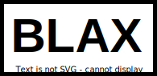

<p align="center" >
    <a href="https://black.readthedocs.io/en/stable/?badge=stable"></a>
</p>

<p align="center">
<a href="https://github.com/psf/black/actions"></a>
<a href="https://black.readthedocs.io/en/stable/?badge=stable"></a>
<a href="https://coveralls.io/github/psf/black?branch=main"></a>
<a href="https://github.com/psf/black/blob/main/LICENSE"></a>
<a href="https://pypi.org/project/black/"></a>
<a href="https://pepy.tech/project/black"></a>
<a href="https://anaconda.org/conda-forge/black/"></a>
<a href="https://github.com/psf/black"></a>
</p>


# Blax: A Fork of Black Python Formatter

Blax is a fork of the popular Python code formatter [Black](https://github.com/psf/black). It aims to provide an alternative approach to code formatting while maintaining compatibility with Black's formatting rules.

## Features

- **Configurable Formatting Options**: Blax offers additional configuration options to customize the formatting behavior according to your preferences.
- **Performance Optimizations**: Blax includes performance enhancements to improve formatting speed for large codebases.
- **Experimental Features**: Explore experimental formatting options that may be incorporated into future Black releases.

## Installation

You can install Blax using pip:

```bash
pip install blax
```

## Usage

Blax can be used as a drop-in replacement for Black. Simply run the `blax` command instead of `black`:

```bash
# Format a single file
blax path/to/file.py

# Format multiple files
blax path/to/dir

# Format the entire project
blax .
```

For more advanced usage and configuration options, refer to the documentation.

## Configuration

Blax supports configuring formatting options through a `pyproject.toml` file or command-line arguments. Here's an example `pyproject.toml` configuration:

```toml
[tool.blax]
line-length = 120
skip-string-normalization = true
experimental-features = ["feature1", "feature2"]
```

See the [documentation](link/to/documentation) for a complete list of available configuration options.

## Contributing

We welcome contributions to Blax! Please follow the guidelines in the [CONTRIBUTING.md](link/to/contributing.md) file.

## License

Blax is released under the [MIT License](link/to/license).

## Acknowledgments

Blax is a fork of the excellent [Black](https://github.com/psf/black) project by the Python Software Foundation. We extend our gratitude to the Black team and contributors for their outstanding work.